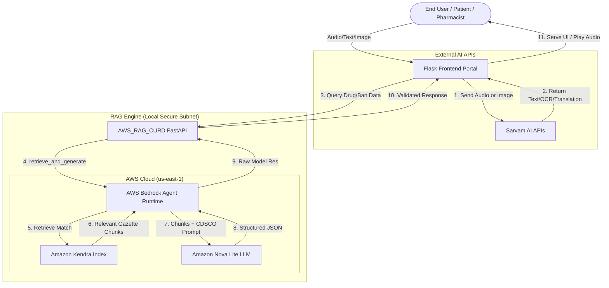

# 🏗️ PharmAI: Technical Architecture

PharmAI adopts a **Dual-Service Modular Architecture**. By strictly decoupling our UI layer from our heavy GenAI Knowledge Base engine, we achieve low-latency interactions, multi-regional scalability, and high fault tolerance.

---

## 💻 Tech Stack

### 1. Frontend / Middleware (PharmAI Portal)
* **Framework**: Python Flask (handling Web Rendering & Middleware Proxying)
* **UI Languages**: HTML5, CSS3, Vanilla JS
* **Core Integrations**:
  * **Sarvam AI (Indic Language Suite)**:
    * *Saaras* (Speech-to-Text)
    * *Bulbul* (Text-to-Speech)
    * *Mayura* (Translation)
    * *Document Parse* (Indic OCR for Prescriptions)

### 2. AWS RAG Backend (AWS_RAG_CURD)
* **Framework**: FastAPI (Asynchronous Python)
* **Cloud Platform**: Amazon Web Services (AWS)
* **Core Integrations**:
  * **AWS Bedrock Knowledge Base**: Manages sessions, embeddings, and cross-reference retrieval.
  * **Amazon Kendra (GenAI Index)**: Enterprise search engine over CDSCO PDF Gazettes.
  * **Amazon Nova Lite (`amazon.nova-lite-v1:0`)**: A blazing fast, highly capable LLM orchestrating instructions, extraction, and synthesis over structured JSON. 

---

## 🔄 High-Level Data Flow

---

## 🔍 Module Deep Dives

### 1. Regulatory Checking (RAG + JSON Forcing)
When checking if a drug is banned (e.g. *Nimesulide + Paracetamol*):
1. The **FastAPI Service** loads a strict system prompt specific to CDSCO compliance.
2. **AWS Bedrock** utilizes **Amazon Kendra** to contextually search against our raw PDFs of government rules without losing context into unstructured chaos.
3. **Nova Lite** pulls the exact Gazette ID, Ban Date, and exact reasons, formatting it into a strictly typed `29-field JSON` for the frontend.
**Outcome**: Zero hallucinations, grounded solely on provided public law PDFs.

### 2. Jan Aushadhi Generic Switcher
Instead of hard-coded search instructions, PharmAI features a dedicated API (`/api/janaushadhi/search`):
* Allows passing dynamic prompts and bypassing rigid compliance templates.
* Operates on a distinct subset of indexed medicine data focused solely on cost-efficiency and mapping expensive salts to their Kendra-approved aliases.

### 3. Universal Accessibility (Sarvam Engine)
1. **Input**: User clicks mic and speaks Hindi (e.g., *"Kya main nimesulide kha sakta hoon?"*)
2. **STT**: Sarvam Saaras converts audio binary to Hindi Text.
3. **Translation**: Sarvam Mayura translates Hindi to English (*"Can I eat nimesulide?"*).
4. **Processing**: English text travels through the RAG flow.
5. **TTS**: Upon retrieval, the English answer translates back to Hindi. Sarvam Bulbul reads the Hindi text aloud to the user over the user interface.

## 🛡️ Security & Privacy Features
* **Zero Client-Side Credentials**: No AWS or Sarvam API keys ever touch the browser. Flask acts as a secure middleware.
* **Server-bound File Ingestion**: Prescriptions are sent as byte streams over memory and aren't permanently written to cloud buckets without user consent.
* **Kendra Segregation**: CDSCO documents are logically segregated from user input data enforcing a multi-tenant compliant data strategy.
