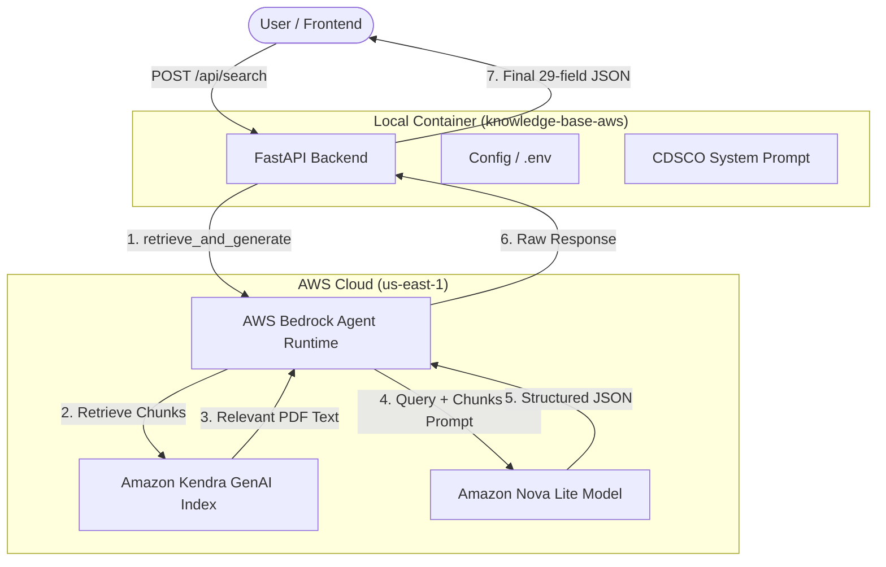

# System Architecture & Technical Flow

This document explains how the **Pharmaceutical Regulatory RAG API** is structured and how your requests travel between the local API and AWS services.

---

## 🏗️ High-Level Architecture

The system follows a **Retrieval-Augmented Generation (RAG)** architecture. Instead of just asking an AI a question, we first find relevant documents from your library and then give those documents to the AI to synthesize an answer.

---

## 🔄 Data Flows

### 1. The Search Path (RAG)
When you call `POST /api/search`:

1.  **FastAPI**: Loads the query and the **CDSCO Compliance System Prompt**.
2.  **AWS Bedrock**: Acts as the **Orchestrator**. It receives your query and knows it needs to use the Knowledge Base.
3.  **Amazon Kendra**: Acts as the **Search Engine**. It scans the 11 PDFs I uploaded, finds the exact paragraphs that mention your query (e.g., "nimesulide"), and sends that text back.
4.  **Amazon Nova Lite**: Acts as the **Smart Architect**. It receives:
    -   Your query ("Is nimesulide banned?").
    -   The snippets from Kendra (The actual Gazette law text).
    -   The CDSCO instructions (How to format the 29 JSON fields).
5.  **Final Response**: Nova Lite generates a professional answer based *only* on the provided PDFs.

### 2. The Ingestion Path (Indexing)
When you call `POST /api/index`:

1.  **FastAPI**: Receives the binary PDF file.
2.  **Kendra Client**: Calls the `batch_put_document` API directly.
3.  **No S3 Needed**: The code sends the document content "in-line" as bytes. Kendra receives it, extracts the text, and makes it searchable within seconds.

---

## 🛠️ Role of Each AWS Service

### 🧠 Amazon Bedrock (Knowledge Base)
**Role: The Manager.**
Bedrock connects the search engine (Kendra) to the brain (Nova Lite). It manages the "Session" and ensures that the model only answers using the retrieved documents (to prevent hallucinations).

### 📚 Amazon Kendra (GenAI Index)
**Role: The Librarian.**
Kendra is specialized in searching through complex enterprise documents (PDFs, HTML, etc.). Unlike a normal database, it understands the **meaning** of words. It ignores typos and finds contextually relevant parts of the law.

### ⚡ Amazon Nova Lite (`amazon.nova-lite-v1:0`)
**Role: The Specialist.**
This is an LLM (Large Language Model). It is exceptionally fast and cost-effective. We use it to:
-   Read the legal language in the PDFs.
-   Extract complex fields (like Gazette ID, Date of Ban, Reasons for Ban).
-   Format everything into a clean JSON object that the frontend can display.

---

## 🛡️ Key Features

-   **Zero Hallucination**: The system prompt instructs the model to say "blank" or "N/A" if the information isn't found in your PDFs.
-   **Security**: All communication is encrypted and uses your specific AWS credentials.
-   **Structure**: Transforms raw PDF text into a strict **29-field schema** defined in `app/models/schemas.py`.
